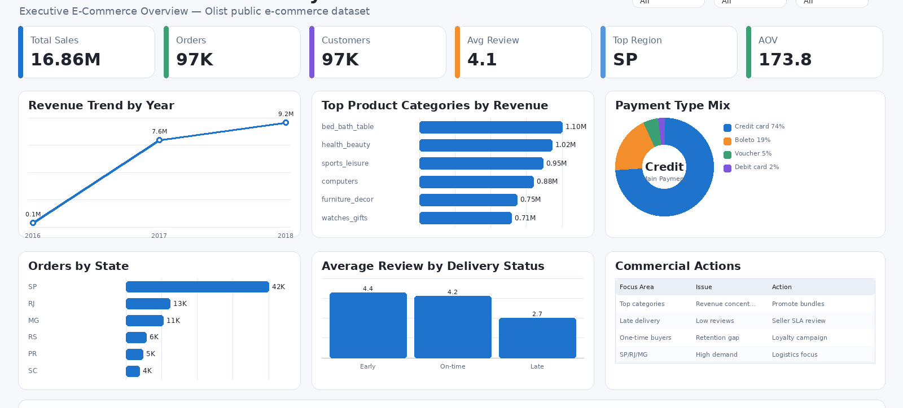
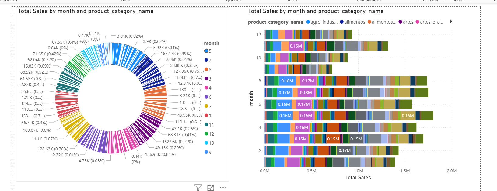

# Brazilian E-Commerce Analytics — Olist Dataset

End-to-end e-commerce analytics project built on the real Olist public dataset — covering multi-table data joining, customer behaviour analysis, product performance, payment trends, and customer segmentation, with an interactive Power BI dashboard and business recommendations.

**Stack:** Python · SQL · scikit-learn · Power BI  
**Domain:** E-Commerce · Customer Analytics · Business Performance

---

## Business Problem

E-commerce businesses generate large volumes of transactional data across orders, customers, products, and payments — but insight is scattered across disconnected tables. This project consolidates the full Olist dataset into a single analytical layer to answer: which customers, products, and regions drive the most value, and what actions will improve retention and revenue?

---

## Dataset

8 relational tables from the [Olist Brazilian E-Commerce public dataset (Kaggle)](https://www.kaggle.com/datasets/olistbr/brazilian-ecommerce):

| Table | Description | Approx. Rows |
|---|---|---|
| `olist_orders_dataset.csv` | Order status and timestamps | 99,441 |
| `olist_customers_dataset.csv` | Customer location and ID | 99,441 |
| `olist_order_items_dataset.csv` | Items per order with pricing | 112,650 |
| `olist_order_payments_dataset.csv` | Payment type and instalments | 103,886 |
| `olist_order_reviews_dataset.csv` | Customer review scores | 99,224 |
| `olist_products_dataset.csv` | Product dimensions and category | 32,951 |
| `olist_sellers_dataset.csv` | Seller location | 3,095 |
| `olist_geolocation_dataset.csv` | ZIP code geolocation | 1,000,163 |

---

## Project Structure

```
├── data/
│   ├── raw/                                     # Original 8 Olist CSV files
│   └── processed/
│       └── cleaned_ecommerce.csv                # Merged and cleaned flat table
├── notebooks/
│   └── datacleaning.ipynb                       # Data merging, cleaning, EDA, segmentation
├── sql/
│   └── ecommerce_analysis_queries.sql           # KPI queries and business analysis
├── powerbi/
│   ├── dash.pbix                                # Power BI dashboard file
│   └── dashboard-screenshot/
│       ├── Ecommerce_dashboard_overview.png
│       └── Ecommerce_exec_dashboard.png
└── README.md
```

---

## Tech Stack

| Tool | Purpose |
|---|---|
| Python (pandas, NumPy) | Multi-table merging, data cleaning, EDA |
| scikit-learn | K-means customer clustering / segmentation |
| Matplotlib / Seaborn | Exploratory visualisations |
| SQL | Business KPI queries, product and regional analysis |
| Power BI + DAX | Two-page interactive executive dashboard |

---

## Data Cleaning & Joining

Handled in `notebooks/datacleaning.ipynb`:
- Merged all 8 tables into a single flat analytical dataset using order ID as the spine
- Handled fan-out carefully — aggregated item and payment tables before joining to avoid row duplication
- Standardised date columns and extracted `year` and `month` features
- Filled missing product category names as `unknown` rather than dropping records
- Removed true duplicate records; output saved to `data/processed/cleaned_ecommerce.csv`

---

## Key Metrics

| Metric | Value |
|---|---|
| Total Orders | ~99,000 |
| Total Revenue | R$ multi-million (BRL) |
| Unique Customers | 99,441 |
| Top Payment Method | Credit Card (~74% of orders) |
| Review Score Average | 4.09 / 5.0 |

---

## Customer Segmentation

K-means clustering applied to identify three customer tiers:

| Segment | Characteristics |
|---|---|
| High-Value | Repeat buyers · High order value · Concentrated in SP and RJ states |
| Medium-Value | Occasional buyers · Average order value · Mixed geographic spread |
| Low-Value | Single-purchase customers · Low order value · Price-sensitive behaviour |

---

## Power BI Dashboards

### Overview Dashboard
Revenue and order trends over time · Top product categories by sales · Customer distribution by Brazilian state · Payment method breakdown.

[

### Executive Dashboard
Delivery performance metrics · Customer segment revenue split · Seasonal trend analysis · Regional performance comparison.

[

Open `powerbi/dash.pbix` in Power BI Desktop and connect to `data/processed/cleaned_ecommerce.csv`.

---

## Key Insights

1. **Geographic concentration:** A small number of states (São Paulo, Rio de Janeiro, Minas Gerais) generate the majority of revenue — the business is not yet penetrating lower-density markets.
2. **Product heavy-tail:** A few categories drive most revenue; a long tail of categories contribute very little — classic 80/20 pattern.
3. **One-time buyer majority:** Most customers placed only one order — the repeat purchase rate is low, pointing to a significant retention opportunity.
4. **Seasonal spikes:** Sales show clear month-over-month variation with predictable seasonal peaks — relevant for inventory and campaign planning.
5. **Order volume ≠ revenue:** Some high-volume periods have lower average order value — top-line order count alone is a misleading performance metric.

---

## Business Recommendations

1. **Improve retention** — launch a loyalty programme targeting the repeat buyer segment and personalised re-engagement campaigns for one-time buyers.
2. **Expand regionally** — increase logistics investment in high-demand states outside SP/RJ to reduce delivery time and capture latent demand.
3. **Optimise product mix** — concentrate marketing spend on top-performing categories; reduce inventory exposure in long-tail low-margin products.
4. **Increase average order value** — implement product bundling, free-shipping thresholds above a target basket size, and cross-sell recommendations.
5. **Plan for seasonality** — prepare inventory and run targeted promotions 4–6 weeks before historically high-revenue months.

---

## Getting Started

```bash
pip install pandas numpy matplotlib seaborn scikit-learn jupyter

jupyter notebook notebooks/datacleaning.ipynb
```

---

## Author

**Revathy Shanmugaraj** · [github.com/Revashan](https://github.com/Revashan)
